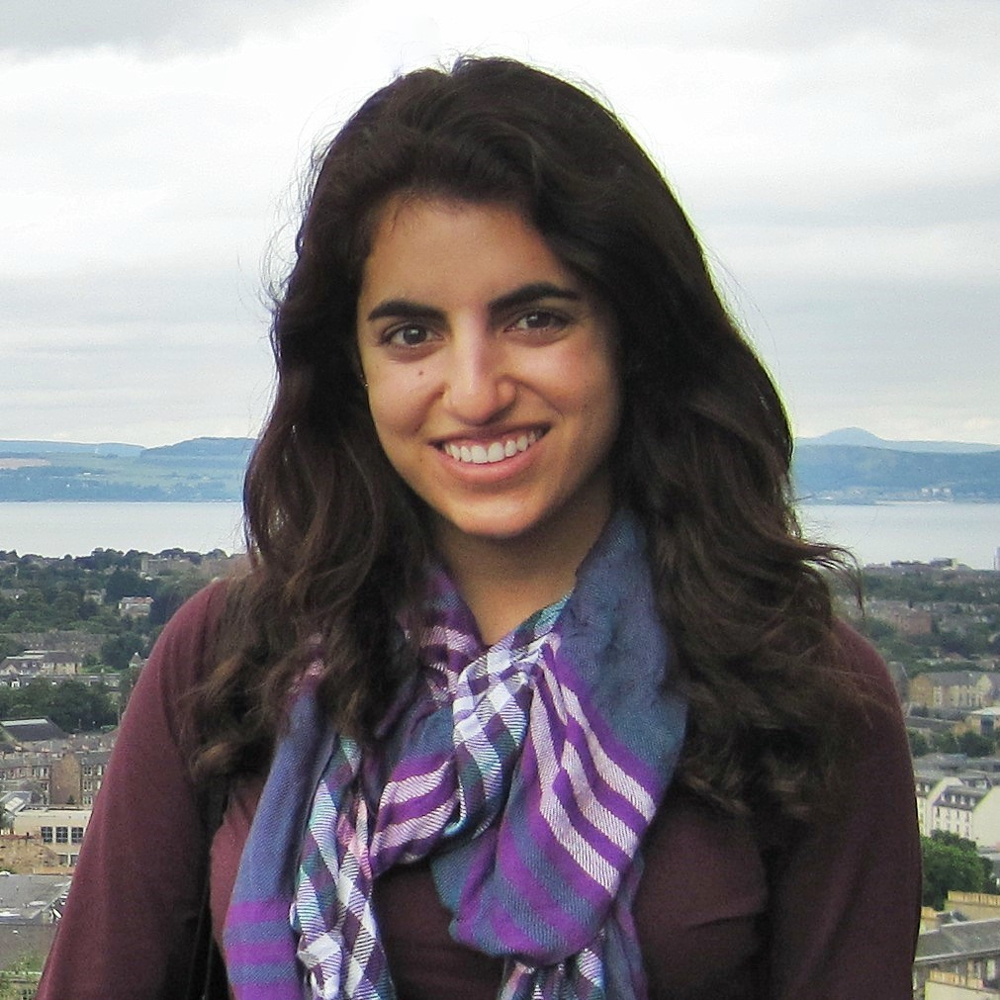

# Personal Information

## Name
Melissa Bica

## Photo
[upload a photo and add it here]
[This is the syntax for uploading a photo: ]

## Email
melissa.bica@colorado.edu

## Website
[If you have a website, put the URL here]

# Current Funding
TA for CSCI 1300

# PhD Program

## Thesis Advisor
Prof. Leysia Palen

## Committee 
[Fill out your thesis committee below, if you know it]

* Prof. Leysia Palen
* Memeber 2
* Member 3
* Member 4 
* Member 5

## Milestones

| Milestone            | Completed         | Planned           |         
| -------------------- | ----------------- | ----------------- |
| Start                | Fall 2014         |                   |
| Area Exam            | {semester} {year} | {semester} {year} |
| Proposal Defense     | {semester} {year} | {semester} {year} |
| Dissertation Defense | {semester} {year} | Spring 2019       |

## Courses

| Course           | Taken             | Planned            | Depth    | Breadth | 
| ---------------- | ----------------- | ------------------ | -------- | ------- |
| CSCI 5828        | Fall 2014         |                    | no       | yes     |
| CSCI 5919        | Fall 2014         |                    | yes      | no      |

## Post Graduation Goals

Not sure yet

# Research

## Publications
[Use the following format to list your publications]

* [year], [title], [conference or journal], [acceptance rate], [link to the paper]

## Presentations
[Insert file pointers or URLs to your presentations below]
* {what,where,when} [pptx](files/presentation-file.pptx)
      
## Awards
[List any awards you've received in the following format]

* 2014, Dean's Fellowship
* 2014, Graduate Student Research Community Development Award
* 2014, Dean's List, Santa Clara University
* 2014, Senior Design Presentation Session Award
* 2014, IEEE Women in Engineering International Leadership Conference Scholarship
* 2014, Upsilon Pi Epsilon Computing and Information Honor Society
* 2013, Willem P. Roelandts and Maria Constantino-Roelandts Grant
* 2013, Tau Beta Pi Engineering Honor Society
* 2013, Grace Hopper Celebration of Women in Computing Scholarship
* 2013, Global Social Benefit Fellowship
* 2012, Cisco-SCU Engineering Fellowship
* 2011, Richard Tapia Celebration of Diversity in Computing Scholarship

# Teaching

* 2014 Fall Teaching Assistant, CSCI 1300, University of Colorado Boulder

# Service
[List any community service you've done during your time at CU]

* {community service}

# Highlights
[Insert any highlights you would like to share, such as travel, project photos, community work, etc.]

